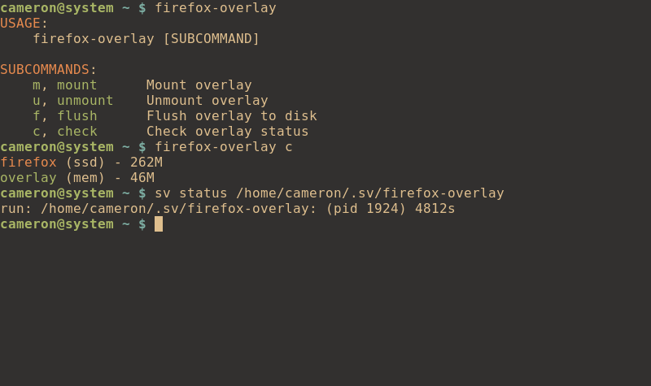

# firefox-overlay

Redirect all firefox writes to a tmpfs backed overlay.



## Before starting

### Backup
Creating a backup of `~/.mozilla/firefox` is highly recommended:

```
cp -a ~/.mozilla/firefox/ ~/.mozilla/firefox-backup/
```

### Overlay
`firefox-overlay` uses `$XDG_RUNTIME_DIR` for the overlay. It would be best to make sure said directory is a tmpfs directory; otherwise usage of `firefox-overlay` is completely pointless.

```
$ stat -f -c %T "$XDG_RUNTIME_DIR"
tmpfs
```

## Install

```
xbps-install -Syu firefox-overlay

make install
```

### firefox-overlay-helper

Mounting an overlay requires root permissions. `firefox-overlay-helper` provides a simple mechanism to mount an overlay with root permissions. Both `sudo` and `doas` are supported; `doas` takes precedence.

#### doas

Users of `doas` need to add the following to `/etc/doas.conf`:

```
permit nopass <user> cmd /usr/bin/firefox-overlay-helper
```

#### sudo

Users of `sudo` need to add the following to `/etc/sudoers`:
```
<user> ALL=(ALL:ALL) NOPASSWD: /usr/bin/firefox-overlay-helper
```

## Usage
```
firefox-overlay help
```

## Runit

### runsvdir
Add the following to your init script:

```
exec runsvdir /home/<user>/.sv
```

### mount
The best way to automatically mount and unmount the overlay is to create a user based runit service:

```
cp -r /usr/share/examples/sv/firefox-overlay ~/.sv/
```

### hourly
Users who wish to sync the contents of the overlay to disk on an hourly basis can enable the following service:
```
xbps-install -Syu snooze

cp -r /usr/share/examples/sv/firefox-overlay-cron ~/.sv/
```

## Cache
Firefox writes data to `~/.cache/mozilla/firefox` which `firefox-overlay` doesn't handle.

Using `firefox-overlay` in conjunction with the following `/etc/fstab` entry will result in **zero** disk writes from Firefox.

```
tmpfs /home/<user>/.cache/mozilla/firefox tmpfs nosuid,nodev,size=1024M 0 0
```

<!-- ## Contributing
Feel free to give recommendations if you find better methods of doing things. Otherwise, feel free to submit a PR with your changes. -->

## Related projects
https://github.com/graysky2/profile-sync-daemon
