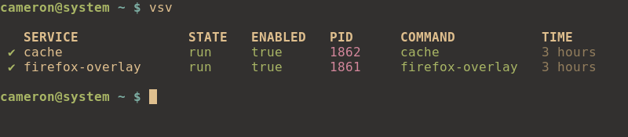

# firefox-overlay

Redirect all Firefox writes to a `tmpfs` backed [`overlay`](https://docs.kernel.org/filesystems/overlayfs.html).

This works by mounting an overlay over `~/.mozilla/firefox` and storing the upper portion of the overlay on a `tmpfs` mountpoint.


## Installation

```sh
git clone https://gitlab.com/camj/firefox-overlay
cd firefox-overlay
make
make install
```

## Configuration

### Backup

Before starting, optionally backup `~/.mozilla/firefox`:

```sh
rsync -aAX ~/.mozilla/firefox/ ~/.mozilla/firefox_backup/
```

### Overlay

`firefox-overlay-helper` requires root permissions to mount/unmount the overlay.

#### sudo

Users of `sudo` need to add the following to `/etc/sudoers`:

```
<user> ALL=(ALL:ALL) NOPASSWD: /usr/local/bin/firefox-overlay-helper
```

#### doas

Users of `doas` need to add the following to `/etc/doas.conf`:

```
permit nopass <user> cmd /usr/local/bin/firefox-overlay-helper
```

#### Notes

* This is not required if `sudo`/`doas` are already configured in no password mode.

* If you installed `firefox-overlay` from your package manager, replace `/usr/local/bin` with `/usr/bin`.

### Daemon

`firefox-overlay` needs to be configured as a daemon in order to mount the overlay automatically. This also allows the overlay to be flushed when the daemon is terminated.

#### runit

Void Linux users can create a user based [`runit`](http://smarden.org/runit/) service:

```sh
mkdir -p ~/.sv
cp -rf init/runit/firefox-overlay ~/.sv/
```

Once done, add the following to your init script:

```
runsvdir /home/<user>/.sv
```

#### systemd

<!-- TODO - add systemd user unit files to repository -->

https://wiki.archlinux.org/title/Systemd/User#Writing_user_units

### Cache

Firefox uses `~/.cache/mozilla/firefox` for cache files which `firefox-overlay` doesn't handle.

You could solve this by symlinking `~/.cache` to a `tmpfs` mountpoint.

#### runit

One could accomplish this by using the included `cache` service:

```sh
cp -rf init/runit/cache ~/.sv/
```

Once done, ensure the `cache` service is running:

```sh
readlink -f ~/.cache
```

This should print `/run/user/1000/.cache` or `/tmp/.cache` if `XDG_RUNTIME_DIR` is unset.

#### systemd

<!-- TODO - add systemd user unit files to repository -->

https://wiki.archlinux.org/title/Systemd/User#Writing_user_units

## Debug

### Usage

```
USAGE:
    firefox-overlay [SUBCOMMAND]

SUBCOMMANDS:
    m, mount      Mount overlay
    u, unmount    Unmount overlay
    f, flush      Flush overlay to disk
    c, check      Check overlay status
```

### Status

You can check the status of the overlay by using the following:

```sh
firefox-overlay check
```

### vsv

Void Linux users can install `vsv` which can provide a nice service overview:

```sh
xbps-install -Syu vsv
```

One could use the following alias to view user services:

```
alias vsv="vsv -d /home/<user>/.sv"
```

Verify the `firefox-overlay` daemon is running:



## Related projects

* https://github.com/graysky2/profile-sync-daemon
